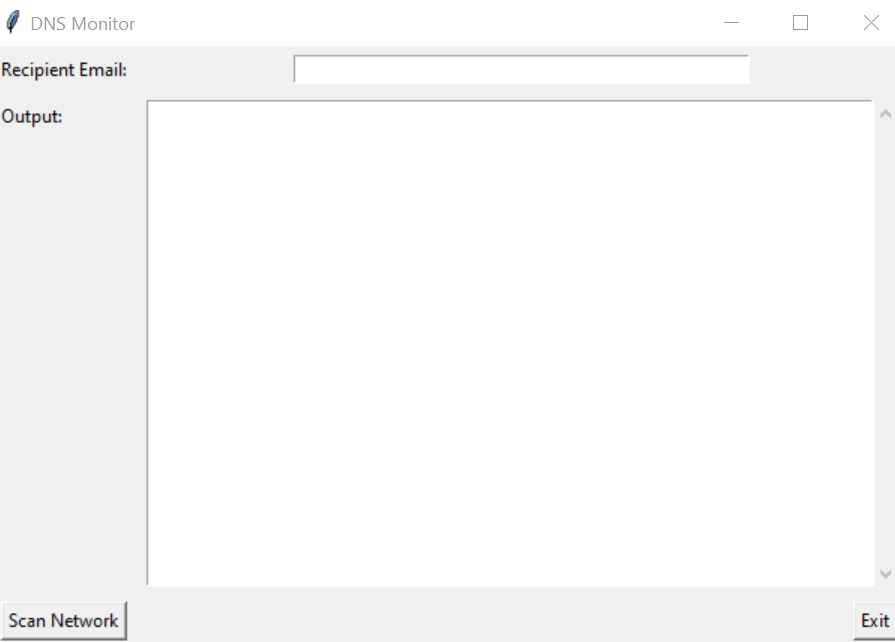

# DNS Cache Monitoring Tool

This project is a Python-based DNS Cache Monitoring Tool with a GUI interface. It scans the network for connected devices and DNS cache entries, checks their IP addresses against VirusTotal for potential threats, and sends email alerts if malicious IPs are detected.

## Features

1. **Network Scanning**:
   - Retrieves connected devices' IP addresses using the ARP table.
   - Retrieves DNS cache entries using the `ipconfig /displaydns` command.

2. **Threat Detection**:
   - Uses the VirusTotal API to check if an IP address is malicious.
   - Analyzes the threat level based on the number of malicious and harmless votes.

3. **Email Alerts**:
   - Sends detailed email reports of malicious IPs detected on the network.
   - Includes information such as malicious votes, harmless votes, and detailed analysis from VirusTotal.

4. **GUI Interface**:
   - Built using `tkinter` for user-friendly interaction.
   - Allows users to input a recipient email address and view logs in a scrolled text widget.

5. **Logging**:
   - Logs all activities (e.g., scanning, threat detection) to a file named `dns_monitor.log`.

## GUI Preview

Below is a preview of the application's GUI:



## How It Works

1. **Start the Application**:
   - Run the script to launch the GUI application.

2. **Input Recipient Email**:
   - Enter the email address where alerts should be sent.

3. **Scan Network**:
   - Click the "Scan Network" button to start scanning for connected devices and DNS cache entries.

4. **Threat Analysis**:
   - The application checks each IP address against the VirusTotal API.
   - If malicious IPs are found, they are logged and included in an email report.

5. **Email Alerts**:
   - If malicious IPs are detected, a detailed report is sent to the recipient email address.

6. **Exit**:
   - Click the "Exit" button to close the application.

## Prerequisites

- Python 3.13 or higher
- Required Python libraries :
  - `dnspython`
  - `requests`
  - `pandas`
  - `schedule`
  - `logging`

## Installation

1. Clone the repository:
   ```bash
   git clone https://github.com/MuhammadSubhanSiddiqui/DNS_cachemonitoring
   cd dns-cache-monitoring
   ```

2. Install dependencies:
   ```bash
   pip install -r requirements.txt
   ```

3. Run the application:
   ```bash
   python example.py
   ```

## Configuration

- Replace the `api_key` in the code with your VirusTotal API key.
- Replace the sender email and password in the `send_email_alert` function with your email credentials.

## File Structure

```
README.md
example.py
requirements copy.txt
images/
    gui.JPG

```

## License

This project is licensed under the MIT License. See the LICENSE file for details.